### Team: Zirui Wang, Shan Huang, Yusheng Guo

Our project is to develop an online ordering website for a restaurant. 

### Deployment on Heroku
https://hw-restaurant-ui.herokuapp.com

## Restaurant-app 

Users can read the menu and order food online at this restaurant.
Any restaurant could use our product as a template to customize their own.

This app contains the following pages: (Pages may change in the development)

### Landing Page
- Welcome users
- Prompt users to sign in first to "Start Order"

### Menu Page
- Users can view food description
- Users can add/remove items in the shopping bag using buttons on the menu page
- Users can confirm the total price of the items in the shopping bag
- Users can click "Confirm contact information and payment" button to checkout

### Order summary Page
Users can: 
- Fill in contact information
- Choose deliver/pick up
- Choose payment method
- Submit order

### Order Confirmation Page
Confirm order details: list of food ordered,total price, and contact information

### Account Information Page & Order Details Page
Users can view their account information and past orders, click one past order and review the order details.

## Iteration 3

In this iteration, we finished authentication and authorization, created more APIs and modify the UI to allow authenticated user view menu page, add items to bag, checkout and submit order and review history orders. Now all the pages and functionalities are ready.

#### Landing page
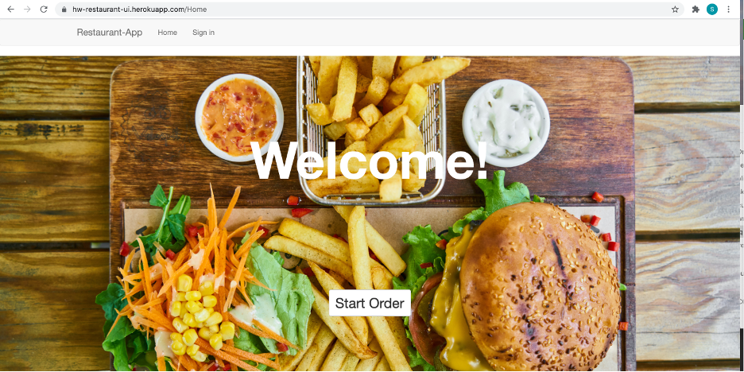

#### Account information
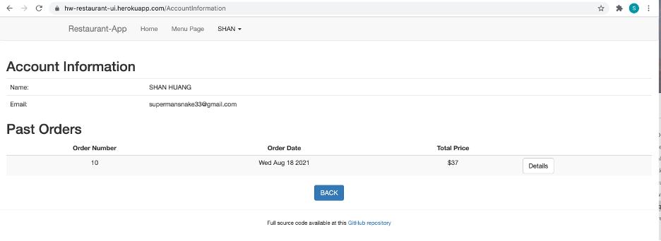

#### Order Details Page
* Users can choose and view a certain history order details by clicking the "Detail" button on Account information Page.

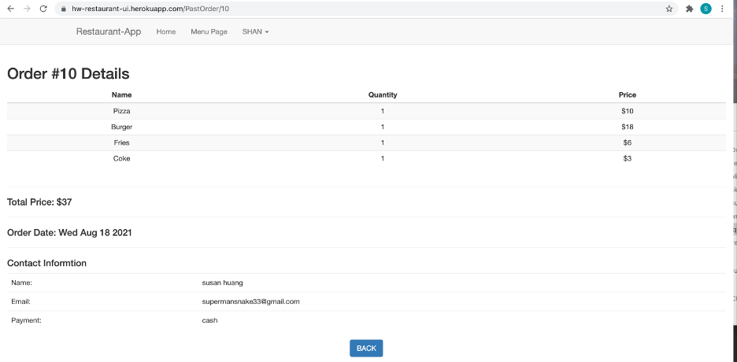

#### Menu Page
* Users can review the menu after login. And it also works as shopping bag to add/delete items as users want.

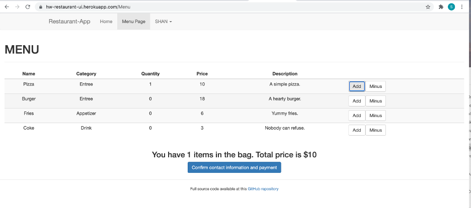

#### Order summary page
* After corfirming all the items in the shopping bag, the user will be directed to this page to fill up the contact information and checkout.

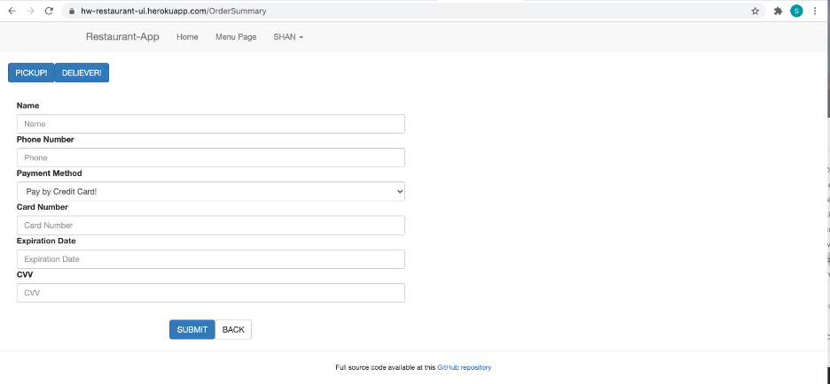

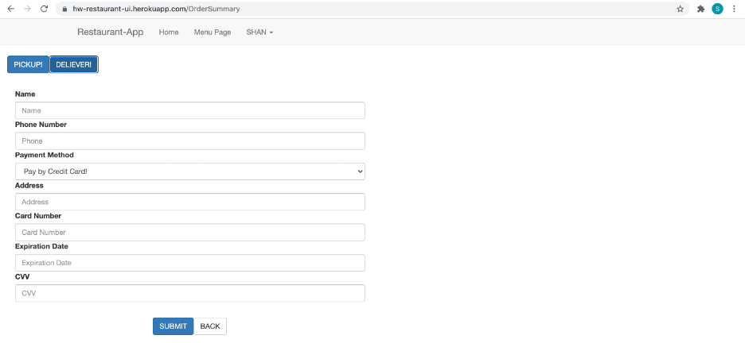

#### Order confirmation page

* After submitting a new order, user will be directed to this page.

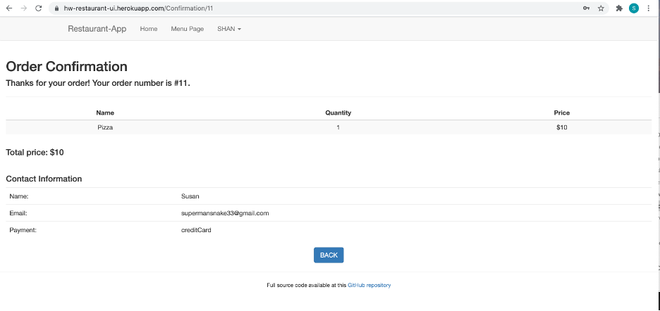

#### Google authentication

* Users can login and off with Google authentication.

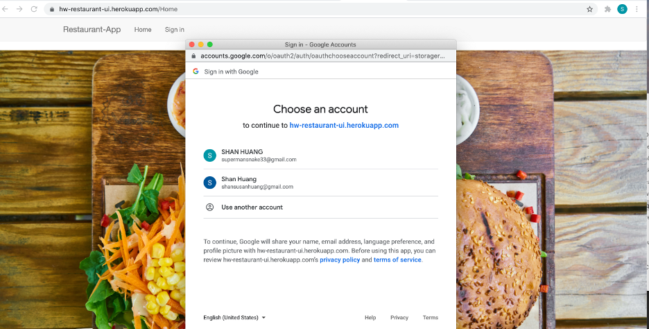

### Team member contribution

- Zirui Wang: Implement and test APIs for submiting order and saving the order in database, Heroku deployment.

- Shan Huang: Authentication & Authorization, Retrieve anthenticated user info on Accout Info Page.

- Yusheng Guo: Modify and polish all the UIs, Test API and UI working together as expected.

## Iteration 2

In this iteration, we kept going modifying front-end components and adding more functionalities on our restaurant ordering app. We set up our MongoDB database on the cloud so that the data can be accessed easily. We also modified our existing data models to guarantee more flexibility in the data fetching process between front and back ends.  Additionally, we introduced Google authentication to our app to boost the user experience in login process.

### New functionalities

#### Register/login page

> Note: this page will be deprecated after introducing Google authentication

* New user can register with name and email on this page.

* Returning users can login with email and password.

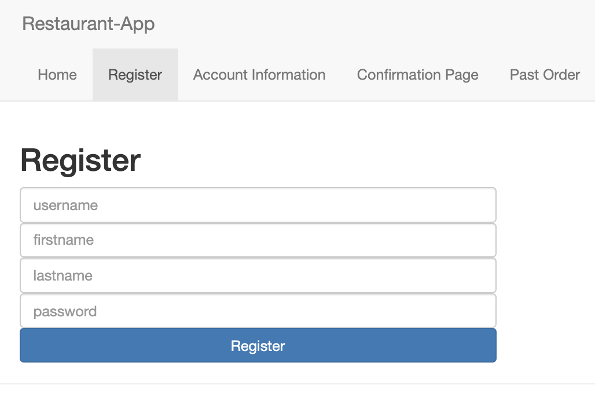

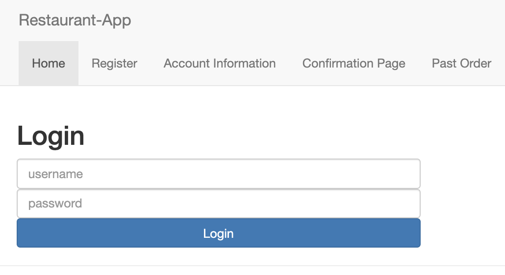

#### Account information

> Note: this page cannot fetch any user information at this point due to the last minute Google authentication implementation. It will be fixed in the next iteration and the user data will be accessed from Google authenticaion API.

* This page displays the contact information of the user, as well as the user's past orders in a list.

* The `BACK` button will take the user back to the menu page.

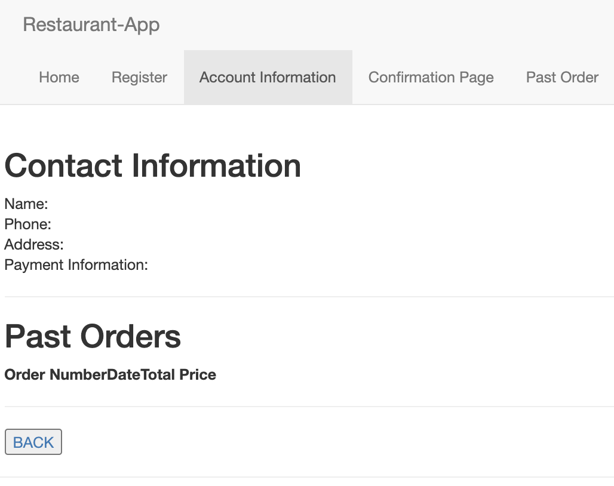

#### Order confirmation page

* After submitting a new order, user will be directed to this page, which displays the order information including order number, pickup location, items list and contact information.

* The order information is dynamically fetched from database, using url parameters (You can manually replace 2 in the url with 1 and you will see a different order)

* The `BACK` button will take the user back to the home page (login page at this point).

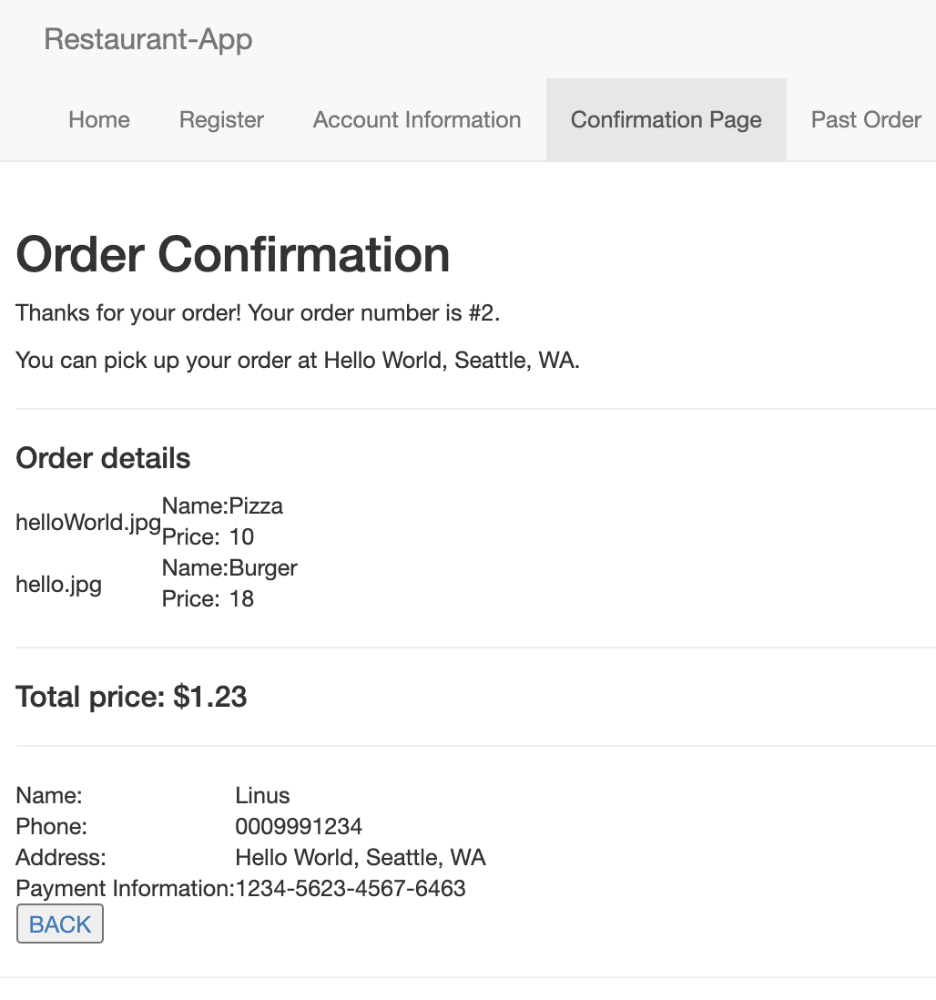

#### Past order information page

* The order information is dynamically fetched from database by order ID, using url parameters (You can manually replace 2 in the url with 1 and you will see a different order)

* The `BACK` button will take the user back to the account information page.

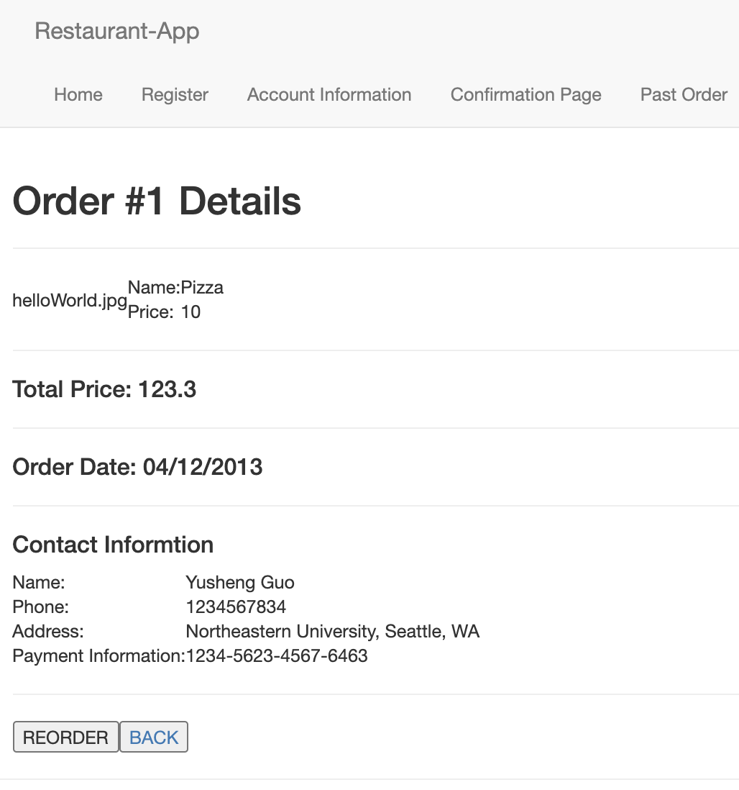

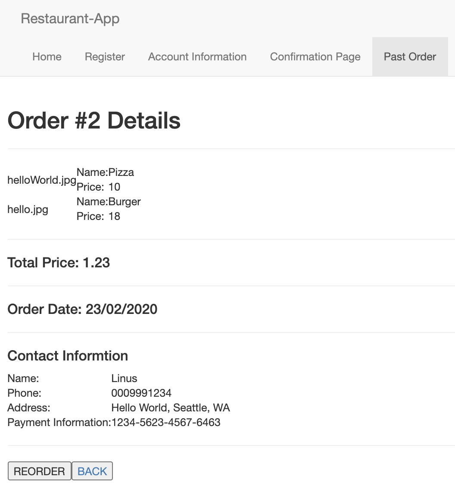

#### Order summary page

* After corfirming all the items in the shopping bag, the user will be directed to this page to fill up the contact information.

* User can specify his/her preference if the new order will be delivered or be picked up using the `PICKUP` and `DELIVERY` buttons.

* Component will be rendered differently, based on the user choice between pickup and delivery.

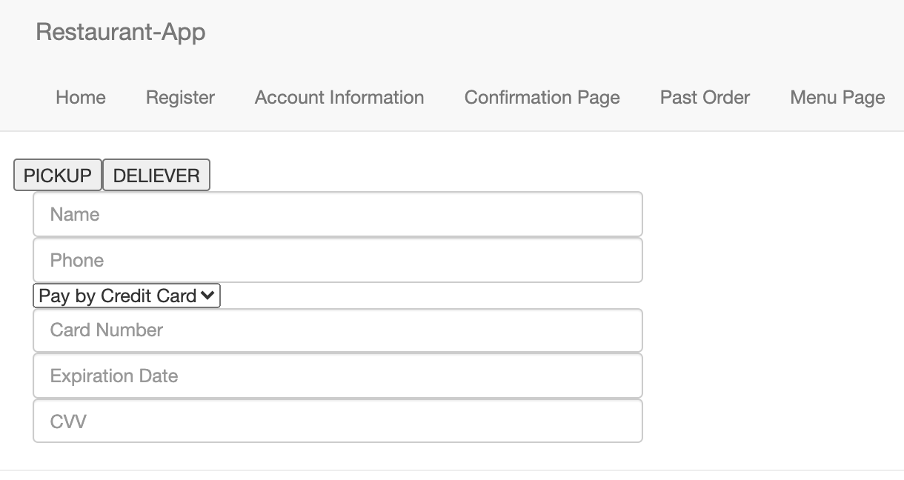

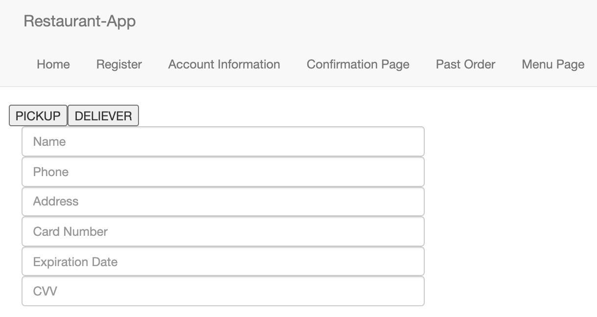

#### Google authentication

* Google users can login and off with Google authentication.

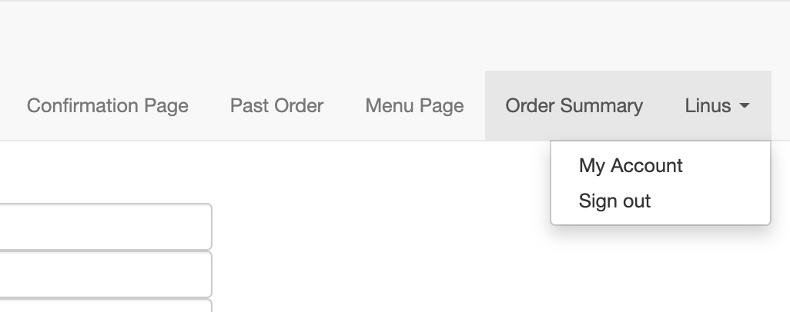

### Team member contribution

- Zirui Wang: Create React components. Implement and test new app functionalities. Implement dynamic routing. Deploy on Heroku

- Shan Huang: Construct and modify data models (using GraphQL schema). Set up MongoDB database on cloud. Align database with APIs to ensure data can be accessed using APIs.

- Yusheng Guo: Create React components. Implement and test APIs to make sure the request data can be fetched from back end. Modify data models.

## Iteration 1

1. Construct Data Models(GraphQL schema)
2. List all the backend APIs we need
3. Make the front end and back end work together in the Menu Page and the Shopping Bag page
4. Create React components(some are just placeholders) to represent the functionality we will be building.

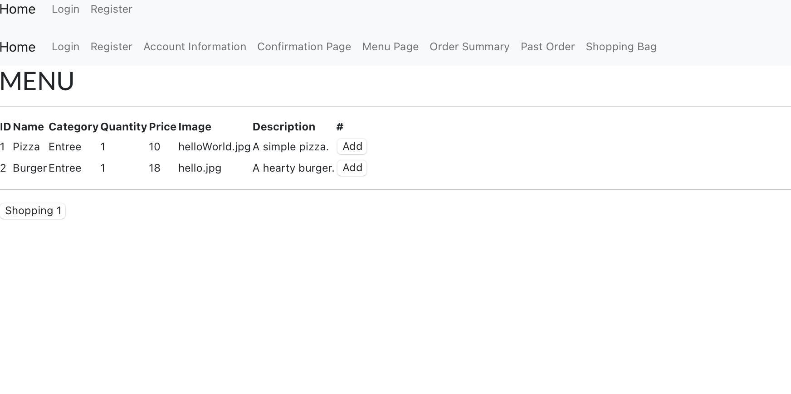

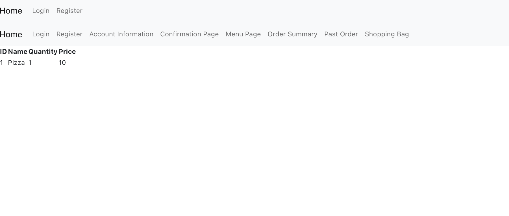

### Team member contribution

- Zirui Wang: Create React components, Test the front end and back end together, Deploy to heroku

- Shan Huang: Construct Data Models(GraphQL schema), List all the backend APIs we need

- Yusheng Guo: Implement Back end APIs, Test the front end and back end together, Deploy to heroku
